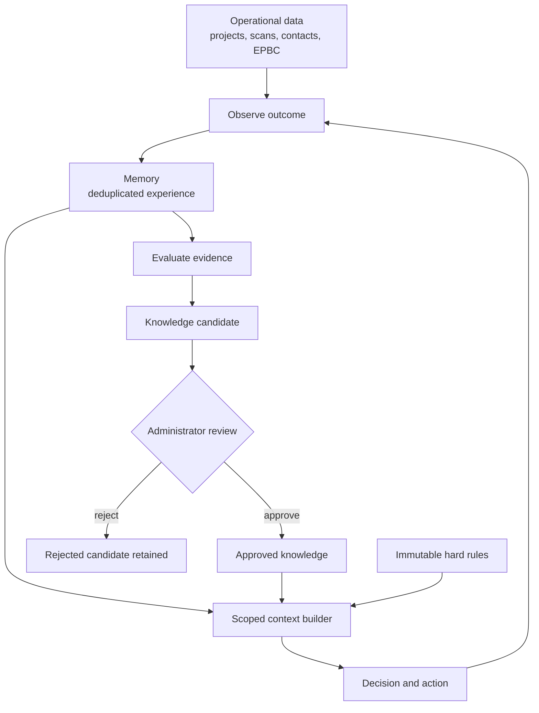

# Memory Architecture

## Purpose

USST now retains useful experience without turning runtime observations into uncontrolled rules. The existing application architecture remains intact: React calls the authenticated Express API, which uses Drizzle over the Supabase PostgreSQL database. The scanner and enrichment workflows remain explicit application services.

## Three layers

Data is current operational state: projects, scan lineage, EPBC records, contacts, enrichment runs, users, and source responses. Existing tables remain data and were not redefined.

Memory is accumulated experience in `agent_memory`. A stable fingerprint deduplicates an identical observation, increments `times_observed`, and updates `last_seen_at`. JSON is limited to flexible evidence values; identity, scope, provenance, confidence, lifecycle, and timestamps remain relational columns.

Knowledge is reusable truth in `agent_knowledge`. Every item records its approval state, evidence count, supporting memory IDs, validation time, and reviewer. Candidates are not authoritative. Approved knowledge is the only knowledge passed to decisions by the context builder.

## Supporting records

- `agent_feedback`: authenticated corrections and confirmations.
- `agent_learning_events`: bounded action/context/outcome telemetry, with sensitive context removed.
- `agent_knowledge_conflicts`: both sides of conflicting evidence and its explicit resolution.

The initial migration is additive and does not update historical projects or scans.

## Retrieval

`MemoryService` scopes retrieval by task and relevant project, source, or developer identifiers. `buildAgentContext()` assembles hard rules, approved relevant knowledge, active relevant memory, and current task data. It caps results and never retrieves the whole store.

PostgreSQL indexes support source, project, developer, type, status, and recency filters. A vector database is deliberately deferred: current entities and workflows have strong relational keys, so semantic retrieval has no demonstrated operational benefit yet.
